# Лабораторная работа №1: базовая настройка PostgreSQL на Debian

## 1. Подготовка среды

Для выполнения лабораторной работы была развернута виртуальная машина с операционной системой Debian версии 12 (Bookworm) в среде VMware.

После установки системы была выполнена её актуализация с использованием пакетного менеджера apt.

---
Для обновления списка доступных пакетов была выполнена команда sudo apt-get update

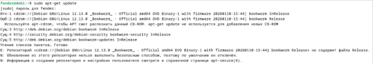

данная команда обращается к репозиториям и загружает актуальную информацию о доступных пакетах и их версиях. 

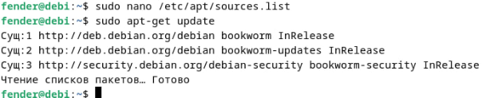

Далее была выполнена команда обновления установленных пакетов sudo apt-get upgrade, эта команда устанавливает последние версии всех уже установленных программ, не затрагивая структуру зависимостей.

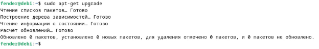

```apt-get update``` - обновляет информацию о пакетах

```apt-get upgrade``` - обновляет установленное ПО

## 2. Установка PostgreSQL

Для работы с базами данных в системе была установлена система управления базами данных PostgreSQL с использованием пакетного менеджера apt.

Установка выполнялась командой ```sudo apt-get install postgresql```

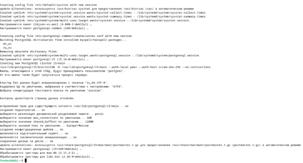

 `apt-get install` — команда для установки пакетов из репозиториев Debian 

`postgresql` — метапакет, устанавливающий сервер PostgreSQL последней доступной версии, а также необходимые зависимости 

В процессе установки автоматически были:
- установлены сервер базы данных PostgreSQL; 
- создана служебная учётная запись postgres; 
- инициализирован кластер базы данных (создана начальная структура хранения данных); 
- настроен и запущен системный сервис PostgreSQL. 

После завершения установки была проверена версия и работоспособность postgresql с помощью `psql –version`, `sudo systemctl status
 postgresql`

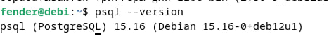\
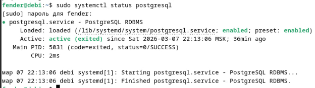

## 3. Создание служебной учётной записи

После установки PostgreSQL в системе автоматически создаётся служебная учётная запись postgres.

Для проверки её наличия выполнено `cat /etc/passwd`

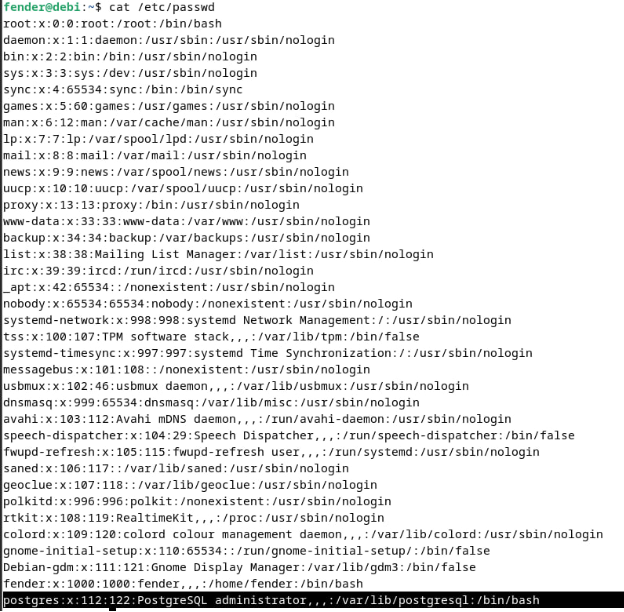

Также можно проверить с помощью команды `id postgres`


Пользователь postgres - это служебная учётная запись, которая:

- владеет всеми файлами PostgreSQL
- запускает сервер базы данны
- используется для администрирования базы данных
  
Через него выполняются основные административные операции.

Пользователь postgres имеет следующие права:

1. Полный доступ к базам данных PostgreSQL
2. Право создавать и удалять базы данных
3. Право создавать пользователей и назначать права
4. Доступ к каталогу данных PostgreSQL (/var/lib/postgresql)

## 4. Первичная настройка конфигурационных файлов

В PostgreSQL основные параметры работы сервера задаются в конфигурационных файлах.

В ходе работы были изучены и изменены следующие файлы:

- `postgresql.conf` - основной файл настроек сервера 
- `pg_hba.conf` - файл управления доступом и аутентификацией

Каталог по которому располагаются файлы конфигурации


Файл `postgresql.conf` был открыт для редактирования с помощью команды `sudo nano /etc/postgresql/15/main/postgresql.conf`.
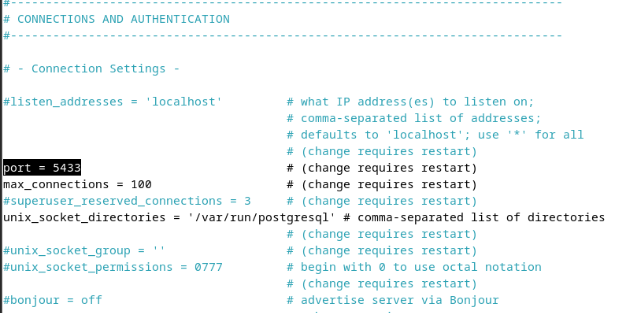

В данном файле настраиваются параметры работы сервера, такие как порт, сетевые подключения и журналирование.

Был изменён параметр `port` на значение 5433

---

В файле `pg_hba.conf` сменил метод аутентификации на `trust` для локальных подключений.

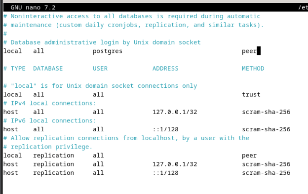

`trust` - разрешает подключение без ввода пароля 

`peer` - проверяет соответствие системного пользователя 

`md5 / scram-sha-256` - требуют пароль

После внесения изменений сервис PostgreSQL был перезапущен.

## 5. Управление сервисом

В операционной системе Debian управление службами осуществляется с помощью системы инициализации systemd.Для управления сервисом PostgreSQL используется утилита systemctl, которая является интерфейсом взаимодействия с systemd.

Чтобы перезапустить службу PostgreSQL была выполнена команда `sudo systemctl restart postgresql`, далее проверка статуса `sudo systemctl status postgresql` 

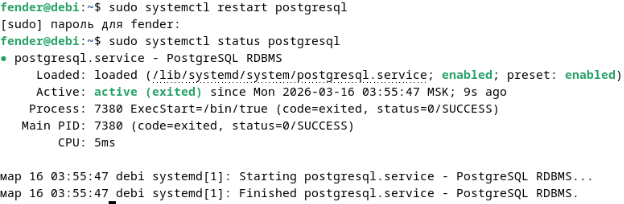

c помощью команды `sudo systemctl enable postgresql`  включил автозапуск и проверил что всё прошло успешно.

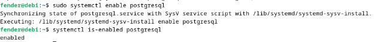

## 6. Создание тестовой базы данных 

Создание пользователя,  базы данных, и назначение владельца

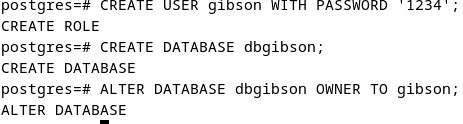

Подключение к базе от имени созданного пользователя

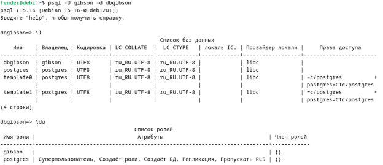

\conninfo - информация подключения

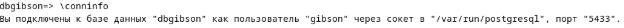

## 7. Знакомство со схемами 

Схема это логическая структура внутри базы данных, которая используется для организации объектов (таблиц, представлений, функций и т.д.).
Её можно представить как пространство имён, которое помогает разделять объекты внутри одной базы данных.

Создание новой схемы


Назначение прав пользователю

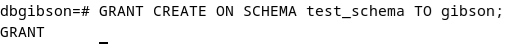

`GRANT` - выдаёт права\
`USAGE` - разрешает использовать схему\
`CREATE` - разрешает создавать объекты\
`ON SCHEMA` - указание типа объекта

Создание таблицы в схеме

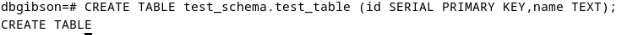

Здесь используется полное имя `schema.table`, позволяет избежать конфликтов имён таблиц.

---
Также можно использовать search\_path. Он определяет, в каких схемах PostgreSQL ищет таблицы по умолчанию.

Посмотреть текущее значение

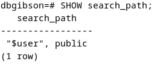

изменение search\_path

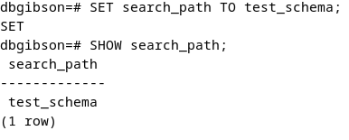

Теперь можно обращаться к таблице без указания схемы

\dn - показывает все схемы текущей базы данных.

## 8. Использование утилиты psql для базовых операций.

Для выполнения базовых SQL-операций была использована утилита psql, она позволяет производить создание таблиц, добавление данных и их модификация.

Создание тестовая таблица в схеме public

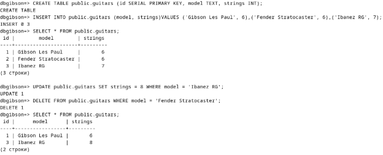

---
Работа с таблицей в другой схеме (test_schema) 

Создание таблицы и обращение к таблице

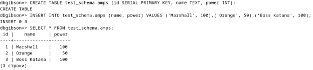

Работа через search_path

`SET search_path TO test_schema;`

Теперь можно писать `SELECT * FROM amps;`

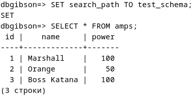

Для работы с SQL-скриптом создал файл `nano guitar_script.sql`

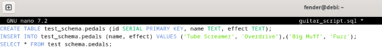

проверил работу скрипта\

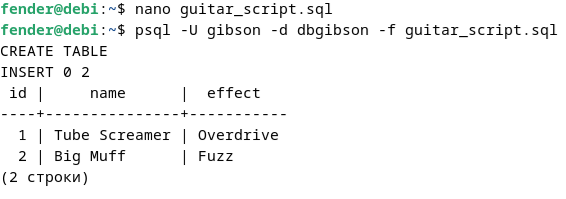

## 9. Настройка локальных и сетевых подключений 

Для настройки локальных и сетевых подключений в `postgresql.conf` изменил значение в стоке `listen_addresses` с `localhost` на `*`, это позволяет принимать подключения с любых ip адресов. 

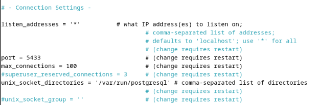

И добавил строку «host    all    all    0.0.0.0/0    trust» в `pg_hba.conf`.

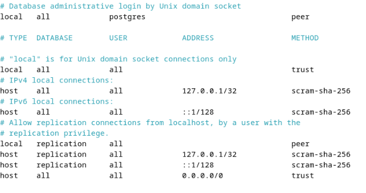

Подключение произвёл\
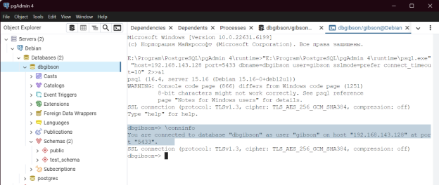

## 10. Журналирование (logging) 

Настроена система журналирования (логирования), которая позволяет фиксировать действия сервера базы данных, ошибки и информационные сообщения. Настройка логирования выполняется в файле `postgresql.conf`

Изменил параметры \
`logging_collector = on`

`log_directory = log`

`log_filename = postgresql.log`

`log_statement = all`

`log_min_messages = info`

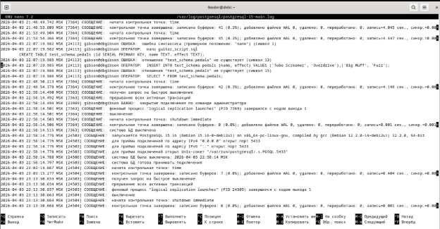

В файле `postgresql.conf` были настроены параметры журналирования (logging\_collector, log\_statement).\
Логи PostgreSQL в Debian располагаются в каталоге `/var/log/postgresql/`.\
После выполнения SQL-запросов в журнале фиксируются подключения и выполняемые команды.

## 11. Назначение ролей и прав 

В PostgreSQL доступ к данным управляется через роли. В работе была создана роль с ограниченными правами и группа ролей, после чего пользователь был добавлен в группу и получил права на чтение данных. Таким образом была реализована модель разграничения доступа с использованием механизма GRANT и наследования ролей.

`ROLE` - роль (в PostgreSQL пользователь = роль) 

`LOGIN` - разрешает вход 

`PASSWORD` - пароль 

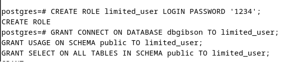

Проверка что доступно только чтение

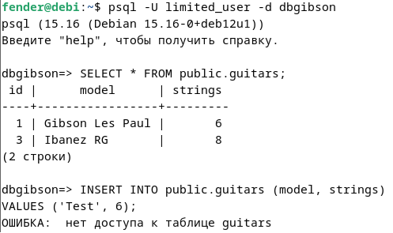

Наследование прав между ролями

Была создана вспомогательная роль `guitar_readers`, наследуется от `limited_user`\

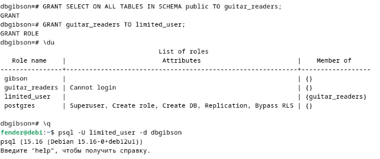

