# Лабораторная работа №2: резервное копирование, восстановление и мониторинг в Debian и PostgreSQL

## 1. Утилиты резервного копирования

В PostgreSQL существуют различные утилиты для резервного копирования данных, среди которых наиболее распространёнными являются `pg_dump` и `pg_basebackup`. Эти инструменты отличаются по принципу работы, уровню копирования и областям применения.

Утилита `pg_dump` предназначена для выполнения логического резервного копирования. Она создаёт копию базы данных в виде SQL-скрипта или архивного файла, содержащего команды для восстановления структуры базы данных (таблиц, индексов, представлений) и самих данных. Данный подход позволяет выполнять выборочное копирование отдельных объектов базы данных и не требует остановки сервера. Кроме того, полученные резервные копии могут быть перенесены на другую систему или использованы при обновлении версии PostgreSQL. Основными сценариями применения `pg_dump` являются резервное копирование отдельных баз данных, перенос данных между серверами, а также восстановление отдельных таблиц или схем.

---
В отличие от `pg_dump`, утилита `pg_basebackup` выполняет физическое резервное копирование. Она создаёт точную копию всех файлов кластера PostgreSQL на уровне файловой системы, включая данные и журналы транзакций (WAL). Такой способ позволяет восстановить состояние всей системы целиком. Для работы pg_basebackup требуется настроенное подключение с правами репликации, а сама утилита часто используется в сочетании с механизмами обеспечения отказоустойчивости. Основными сценариями её применения являются полное резервное копирование кластера, восстановление системы после сбоев, а также создание реплик (standby-серверов).

Из этого следует что, `pg_dump` и `pg_basebackup` решают разные задачи. Первая подходит для логического и выборочного резервного копирования на уровне отдельных баз данных и объектов, тогда как вторая используется для полного физического копирования всего кластера PostgreSQL и применяется в задачах восстановления и репликации.

## 2. Создание резервной копии 

Для создания резервной копии базы данных в PostgreSQL используется утилита `pg_dump`, позволяющая выполнить полное логическое копирование базы данных. В рамках лабораторной работы было выполнено резервное копирование базы данных, созданной ранее, с использованием различных параметров форматирования.

---
Основная команда для создания резервной копии имеет следующий вид:

`pg_dump -U postgres -d имя_базы -F c -f backup.dump`

где параметр `-U` задаёт пользователя, `-d - имя базы данных`, `-F`  формат резервной копии, а `-f`  имя выходного файла.

Параметр `-F` определяет формат создаваемого дампа. В ходе работы были рассмотрены следующие варианты:

- `-Fc (custom)` - пользовательский формат. Резервная копия сохраняется в сжатом бинарном виде. Данный формат удобен тем, что поддерживает выборочное восстановление отдельных объектов базы данных с помощью утилиты `pg_restore`. Также обеспечивает уменьшение размера файла за счёт встроенного сжатия. 
- `-Ft (tar)` - архивный формат. Резервная копия создаётся в виде tar-архива. Такой формат также позволяет использовать `pg_restore`, однако не поддерживает сжатие по умолчанию и менее гибок по сравнению с custom-форматом. 

Помимо указанных параметров, утилита `pg_dump` поддерживает и другие опции, например:

- `-Fp` - текстовый формат (обычный SQL-скрипт), который можно восстановить через psql; 
- `-v` - вывод подробной информации о процессе выполнения (verbose); 
- `-Z` - уровень сжатия (используется с custom-форматом); 
- `-t` - резервное копирование отдельной таблицы; 
- `-n` - резервное копирование определённой схемы. 

Для выполнения полного резервного копирования наиболее предпочтительным является использование формата `-Fc`, так как он обеспечивает оптимальное соотношение размера, гибкости и возможностей восстановления. Формат `-Ft` может использоваться в случаях, когда требуется хранение резервной копии в виде стандартного архива, однако он уступает custom формату по функциональности.

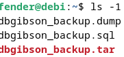

## 3. Частичное (выборочное) резервное копирование 

Частичное резервное копирование позволяет сохранить только выбранные объекты базы данных (отдельные схемы или таблицы), в отличие от полного дампа, который содержит всю базу данных. Это уменьшает объём резервной копии и ускоряет процесс её создания, однако требует внимательного учёта зависимостей между объектами базы данных.

---
Дамп схемы test_schema производится через pg_dump с указанием схемы:

`-n test_schema`

Для дампа определённых таблиц:

`-t схема.таблица`

Все дампы созданы

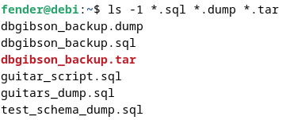

## 4. Восстановление из резервной копии 

Восстановление базы данных было выполнено с использованием утилиты `psql` для SQL-дампа и `pg_restore` для бинарного дампа.

Сначала была создана новая база данных, после чего выполнено восстановление резервной копии.

В результате были успешно восстановлены структура базы данных (схемы, таблицы) и данные. Проверка восстановления выполнена с помощью команды просмотра таблиц `\dt`

Для восстановления из дампа с помощью `psql` создана `db_test_dump`

`psql -U postgres -d db_test_dump -f dbgibson_backup.sql`

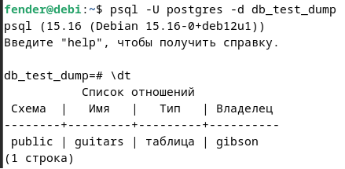

Для восстановления из дампа с помощью `pg_restore` создана `db_test2_dump`

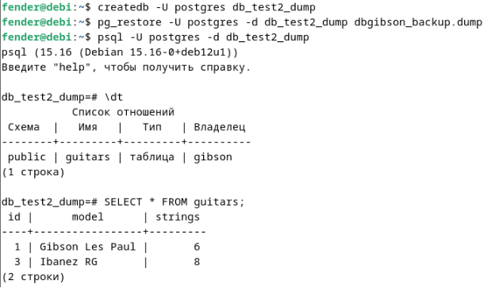

## 5. Автоматизация бэкапов с помощью cron 

В операционной системе Debian была настроена автоматизация резервного копирования базы данных PostgreSQL с использованием планировщика задач cron. Был создан скрипт, выполняющий ежедневное создание дампа базы данных с указанием текущей даты в имени файла. Скрипт запускается автоматически каждый день в заданное время. Также реализована ротация резервных копий, автоматическое удаление файлов старше 7 дней, что позволяет контролировать использование дискового пространства.

Создание папки для бэкапов

`mkdir -p ~/pg_backups`

создание файла скрипта

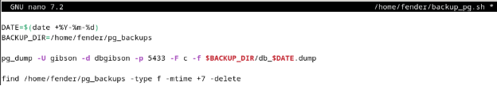

Добавление разрешение выполнения файла

`chmod +x ~/backup_pg.sh`

`chmod` – сменить режим доступа

`+x` – право на выполнение

Проверка работоспособности на ручном запуске

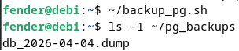

---
Добавление в планировщик `cron`

`crontab -e` – открытие планировщика

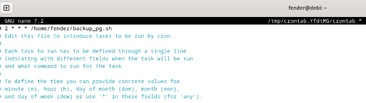

`0 2 * * *` это минута, час, день месяца, месяц, день недели

`*` - для каждого

Получается что дапм будет создаваться в 02:00 каждый день

Для проверки изменю на каждую минуту, для этого в `cron` выставлю везде `*`

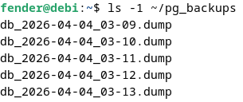

## 6. Мониторинг состояния системы

Для мониторинга состояния системы использовались утилиты `top`, `htop` и `iotop`. С их помощью анализировалась загрузка процессора, использование оперативной памяти и операции ввода вывода, создаваемые сервером PostgreSQL. В ходе наблюдения были выявлены процессы PostgreSQL и проанализированы их показатели потребления ресурсов.

### Top

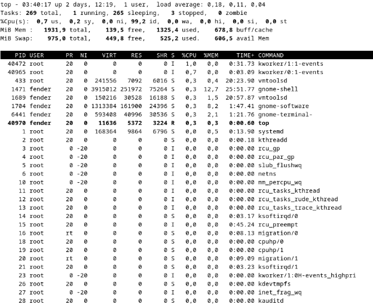

CPU

`us` – время, затраченное на выполнение пользовательских процессов\
`sy` – время, затраченное ядром системы\
`ni` – время процессов с изменённым приоритетом (nice)\
`id` – простаивающее время процессора\
`wa` – время ожидания операций ввода-вывода (диск)\
`hi` – время обработки аппаратных прерываний\
`si` – время обработки программных прерываний\
`st` – время, «украденное» виртуальной машиной (steal time)\

MiB Mem

`total` – общий объём оперативной памяти\
`free` – полностью свободная память\
`used` – используемая память\
`buff/cache` – память, занятая под кэш и буферы (может быть освобождена при необходимости)

MiB Swap(переезд на диск)

`total` – общий объём swap-памяти\
`free` – свободная swap-память\
`used` – используемая swap-память\
`avail Mem` – доступная память с учётом кэша (реально доступная системе)

### Htop

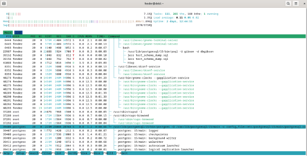

`PID` – идентификатор процесса\
`USER` – пользователь, от которого запущен процесс\
`PR` – приоритет процесса\
`NI` – значение nice (влияет на приоритет)\
`VIRT` – виртуальная память процесса\
`RES` – фактическое использование оперативной памяти\
`SHR` – разделяемая память\
`S` – состояние процесса\
`%CPU` – загрузка процессора процессом\
`%MEM` – использование оперативной памяти\
`TIME+` – общее время использования CPU\
`COMMAND` – имя процесса

## 7. Мониторинг PostgreSQL 

Для мониторинга PostgreSQL использовались системные представления `pg_stat_activity` и `pg_stat_database`. С их помощью анализировались активные подключения, выполняемые запросы и длительность их выполнения. Для управления процессами применялись функции `pg_cancel_backend` и `pg_terminate_backend`, позволяющие завершать долгие или зависшие запросы.

- просмотр активных процессов
- активные (выполняющиеся) запросы
- “долгие” запросы

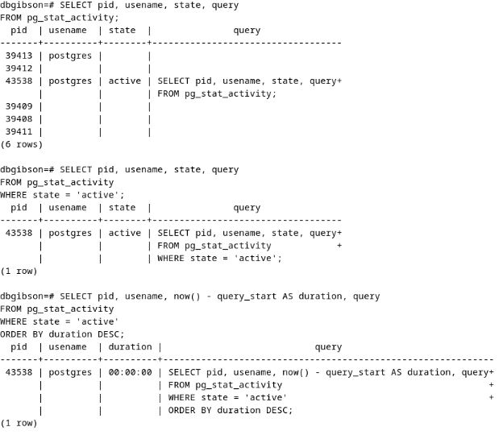

|Поле | Значение |
|-----|----------|
|pid|	ID процесса|
|usename|	пользователь|
|state|	состояние|
|query|	SQL-запрос|
|query_start|	время начала|

### state значения
| | |
|-------|---------|
|active|	выполняется|
|idle|	простаивает|
|idle in transaction|	зависшая транзакция|

---
Для демонстрации принудительного завершения процесса использовано `SELECT pg_sleep(120);`

Завершение запроса с помощью `SELECT pg_cancel_backend(pid);`

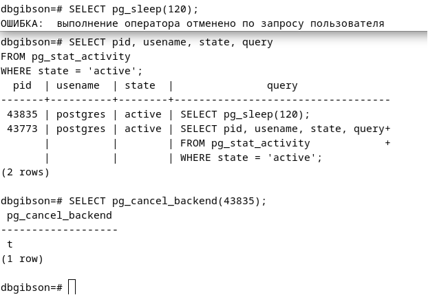

Принудительное завершение процесса с помощью `SELECT pg_terminate_backend(pid);`

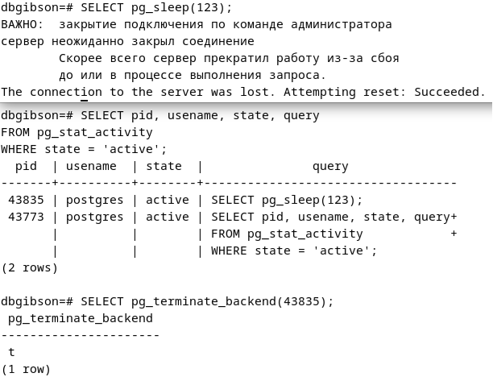

## 8. Логирование и анализ логов 

Логи PostgreSQL располагаются в директории `/var/log/postgresql` и содержат информацию о работе СУБД: подключения, запросы, ошибки и операции с базой данных. Системные логи Debian (файлы `syslog` и `daemon.log`) фиксируют события операционной системы, включая запуск служб, выполнение задач cron и системные ошибки. Таким образом, PostgreSQL логирует события уровня базы данных, а операционная система - события уровня системы.

По пути `/var/log/postgresql` располагаются логи `postgresql`

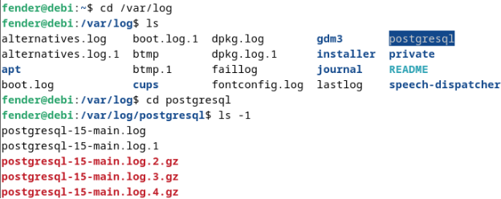

---
В Debian 12 системные логи могут храниться не в файлах `syslog` и `daemon.log`, а в журнале `systemd` (`systemd-journald`). Просмотр логов выполняется с помощью команды `journalctl`. При необходимости классическое файловое логирование можно включить, установив службу `rsyslog`.

Установка и запуск службы `rsyslog` 

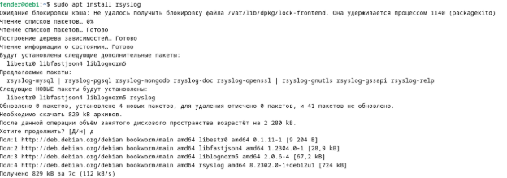

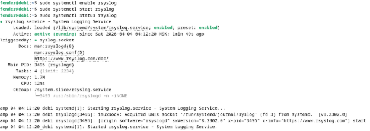

Теперь файл `syslog` появился\
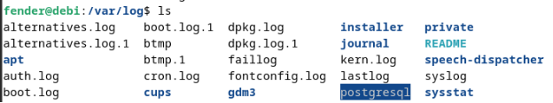

