# Лабораторная работа №3: Расширенные возможности и оптимизация PostgreSQL на Debian

## 1. Оптимизация конфигурации PostgreSQL

В ходе работы были изучены параметры конфигурационного файла `postgresql.conf`, влияющие на производительность системы: `shared-buffers`, `work-mem`, `maintenance-work-mem`, `effective-cache-size`. Параметр `shared-buffers` определяет объём памяти, используемый PostgreSQL для кэширования данных. Параметр `work-mem` задаёт объём памяти для выполнения операций сортировки и соединения. Параметр `maintenance-work-mem` используется при выполнении операций обслуживания, таких как создание индексов и `VACUUM`. Параметр `effective-cache-size` указывает предполагаемый объём доступного кэша операционной системы. Значения параметров были выбраны с учётом объёма оперативной памяти виртуальной машины. После изменения конфигурации сервер PostgreSQL был перезапущен, а корректность настроек проверена с помощью команды `SHOW`.

Общий объём памяти можно узнать с помощью `free -h`, для виртуальной машины доступно 2гб.

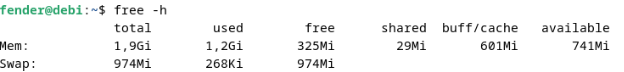

После изменения параметров видим

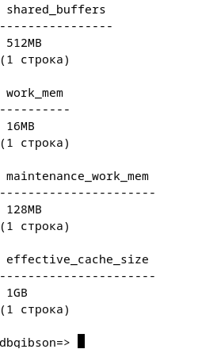

## 2. Создание и анализ индексов 

Для выполнения задания создана новая таблица и заполнена тестовыми данными с помощью функции `generate-series`. До создания индекса запрос выполнялся с использованием последовательного сканирования (`Seq Scan`), что приводило к увеличенному времени выполнения. После создания индекса на столбце strings план выполнения изменился на Index Scan, что позволило сократить время выполнения запроса. Сравнение планов выполнения произведено с помощью команд EXPLAIN и `EXPLAIN ANALYZE`.

Проверка запроса без индексов

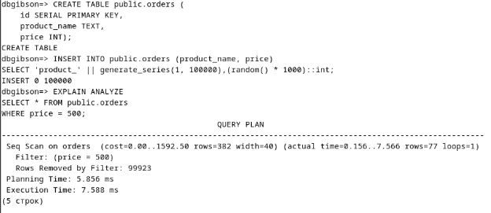

Далее создание индексов и проверка запроса

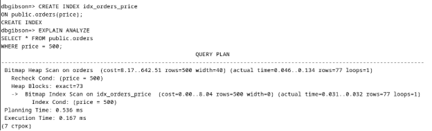

Из скриншотов видно, что время выполнения значительно сократилось с 7.5ms до 0.2ms

## 3. Хранимые функции

Создана хранимая функция на языке `PL/pgSQL`, которая принимает параметры и выполняет проверку корректности данных. 
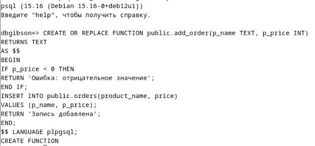

При передаче отрицательного значения функция возвращает сообщение об ошибке, в противном случае выполняется вставка записи в таблицу. 

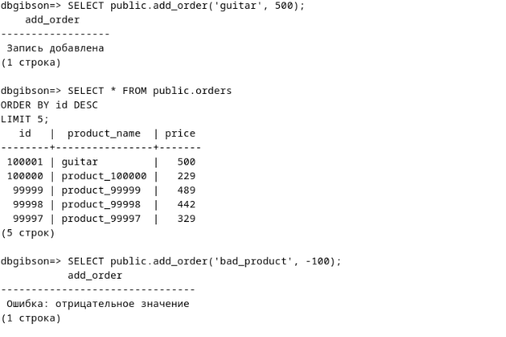

Работа функции была проверена с помощью её вызова в среде `psql`, а также выполнена проверка фактического добавления данных в таблицу.

## 4. Триггеры 

Создан триггер, проверяющий корректность данных при вставке и обновлении записей. Для этого была реализована функция, которая проверяет значение цены и при попытке вставки отрицательного значения вызывает исключение. 

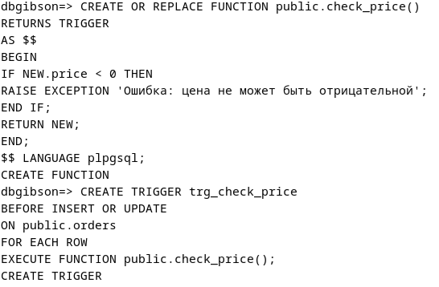

Триггер был настроен на срабатывание перед выполнением операций `INSERT` и `UPDATE`. Проверка показала, что при корректных данных запись добавляется, а при некорректных операция прерывается с ошибкой.

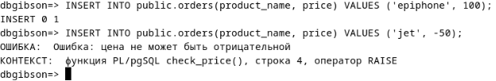

## 5. Автоматическая очистка и статистика (VACUUM, ANALYZE) 

В этом пункте изучены механизмы автоматической очистки и сбора статистики в PostgreSQL. Параметр `autovacuum` включён по умолчанию и отвечает за автоматическое выполнение операций `VACUUM` и `ANALYZE`. 

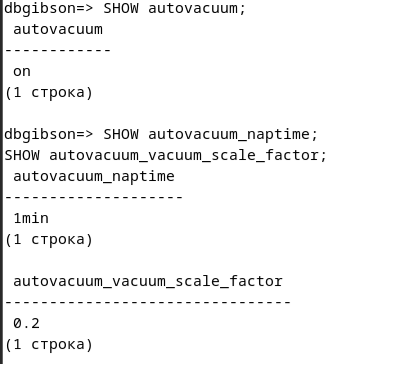

- `autovacuum_naptime` определяет интервал проверки таблиц
- `autovacuum_vacuum_scale_factor` порог запуска очистки.

Для демонстрации работы `VACUUM ANALYZE` необходимо создать «мёртвые» строки. Узнать их наличие и количество можно с помощью `pg_stat_user_tables`.

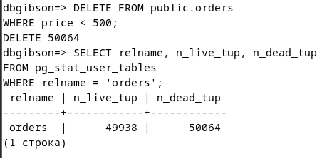

После выполнения `VACUUM ANALYZE` количество `n_dead_tup` должно быть нулевым, что и видно на скриншоте.

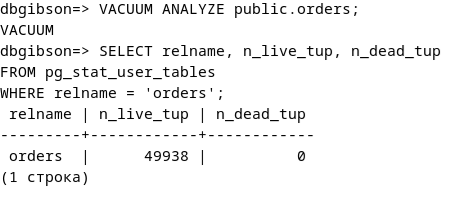

Также с помощью `pg_stat_user_tables` можно плоучить информацию о количестве выполненных операций `vacuum` и `autovacuum`. А с помощью `pg_stat_all_indexes` узнать сколько раз использовался индекс.

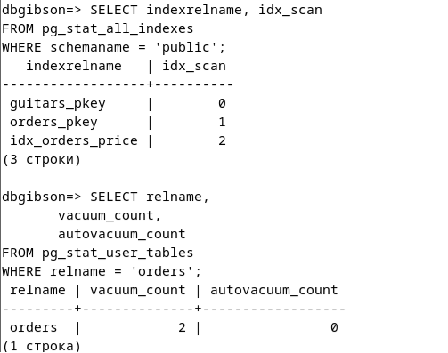
